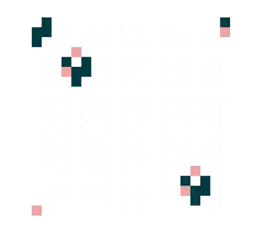

# @rankdim/conway

A lightweight library for beautfiul game of life embeds.


<!-- features -->

<!-- <table>
<tr>
 <td>
    
  </td>
  <td>

```javascript
import { conway, patterns } from "@rankdim/conway";

const game = conway("conway-1", {
  cellSize: 20,
  gridWidth: 20,
  gridHeight: 20,
});

game.place(patterns.glider, 1, 1);
game.place(patterns.glider, 5, 5);
game.place(patterns.glider, 9, 9);
game.start();
```

  </td>
 
</tr>
</table> -->


## Installation


```bash
$ npm i @rankdim/conway
```

## User Guide

<table>
<tr>
  <td>

```javascript
import { conway, patterns } from "@rankdim/conway";

const game = conway("conway-1", {
  cellSize: 20,
  gridWidth: 20,
  gridHeight: 20,
});

game3.place(patterns.gosperGliderGun, 1, 1);
game.start();
```

  </td>
  <td>
    
  </td>
</tr>
</table>

<table>
<tr>
  <td>

```javascript
import { conway, patterns } from "@rankdim/conway";

const game = conway("conway-1", {
  cellSize: 20,
  gridWidth: 20,
  gridHeight: 20,
});

game4.randomize(0.3)
game.start();
```

  </td>
  <td>
    
  </td>
</tr>
</table>


| Option          | Type      | Default                        | Description                                           |
| --------------- | --------- | ------------------------------ | ----------------------------------------------------- |
| `cellSize`      | `number`  | `10`                           | The size of each cell.                       |
| `gridWidth`     | `number`  | `50`                           | The number of cells in the horizontal direction.      |
| `gridHeight`    | `number`  | `50`                           | The number of cells in the vertical direction.        |
| `backgroundColor` | `string`  | `"rgba(255, 255, 255, 1)"`     | The background color of the canvas.                   |
| `cellColor`     | `string`  | `"rgba(13, 63, 68, 1)"`        | The color of the living cells.                        |
| `deadCellColor` | `string`  | `"rgba(215, 74, 74, 0.5)"`     | The color of the dead cells.                          |
| `gridColor`     | `string`  | `"rgba(0, 0, 0, 0.1)"`        | The color of the grid lines.                          |
| `showGrid`      | `boolean` | `true`                         | Whether to display the grid lines.                    |
| `showDead`      | `boolean` | `true`                         | Whether to display the dead cells.                    |
| `animationSpeed`| `number`  | `600`                          | The delay between each generation in milliseconds.    |
| `toroidal`      | `boolean` | `true`                         | Whether the grid wraps around at the edges.           |

<!-- 
Minimal Complete example (using CDN)
```html

``` -->


## License

[MIT](LICENSE)
